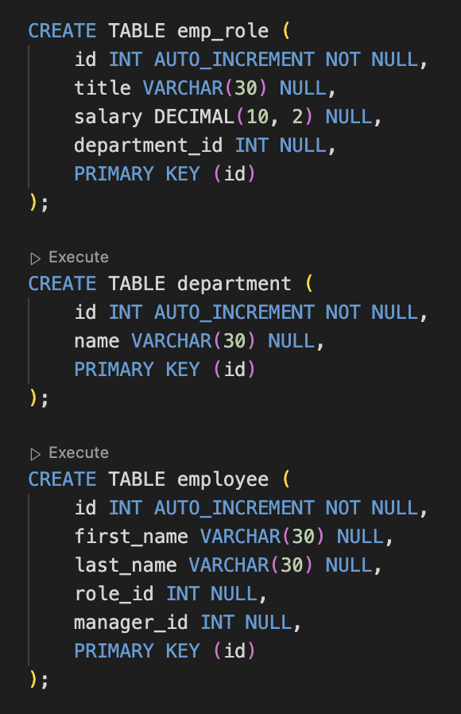
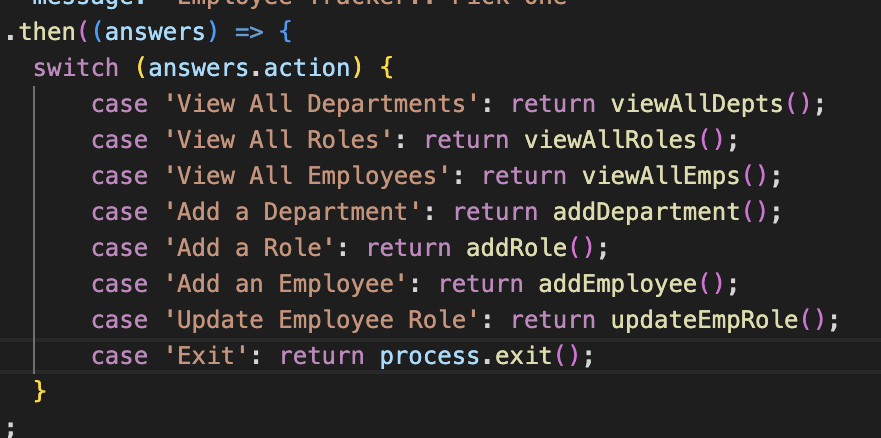

# Employee Tracker

## Table of Content
* [Description](#description)
* [Instructions](#instructions)
* [Visuals](#visuals)
* [Walkthrough](#walkthrough)

## Description
This project was made so that you are presented with a table of all your employees and their jobs, their salary, and who their manager is. There is an ability to add roles, departments, and to update employee roles.

## Instructions
In the CLI, run "npm i" to install all the dependencies, then run "npm start" to start the inquirer prompts.

## Visuals

Picture of code that creates all the tables and their required components.

Code that links all the functions to said questions. 

## Walkthrough
[Video of walkthrough](https://drive.google.com/file/d/1-5drXzcpg_mn-XfBBsy315K6VkoRzZTQ/view?usp=sharing)